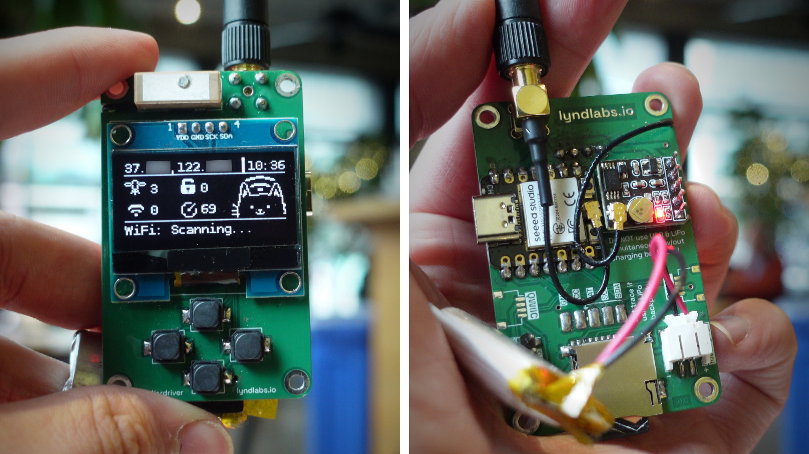

# Cutie Wardriver ❤️📡
### **The cute ESP32-based pocket wardriver!**

## Features:
- Xiao / QT-Py compatible
- SH1106 OLED
- MicroSD Card
- LiPo Battery (charging + meter)
- Qwiic Connector

## Firmware:
More docs coming soon.  Check out the [official firmware repo](https://github.com/LyndLabs/Cutie-Wardriver-Firmware)!
